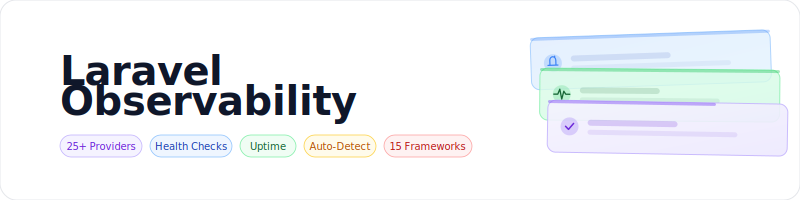

<p align="center">
    <picture>
        <source media="(prefers-color-scheme: dark)" srcset="art/banner-dark.svg">
        <source media="(prefers-color-scheme: light)" srcset="art/banner-light.svg">
        
    </picture>
</p>

<p align="center">
A comprehensive observability package for Laravel with auto-detection of 25+ monitoring services, health checks, uptime monitoring, and frontend/backend error tracking integration.
</p>

<p align="center">
    <a href="https://packagist.org/packages/jeremykenedy/laravel-observability"></a>
    <a href="https://packagist.org/packages/jeremykenedy/laravel-observability"></a>
    <a href="https://github.com/jeremykenedy/laravel-observability/actions/workflows/tests.yml"></a>
    <a href="https://github.styleci.io/repos/1194847006?branch=main"></a>
    <a href="https://opensource.org/licenses/MIT"></a>
</p>

#### Table of Contents
- [Features](#features)
- [Framework Support](#framework-support)
- [Requirements](#requirements)
- [Installation](#installation)
- [Configuration](#configuration)
- [All Supported Providers](#all-supported-providers)
- [Backend Providers](#backend-providers)
- [APM and Performance](#apm-and-performance)
- [Frontend Monitoring](#frontend-monitoring)
- [Testing and Quality](#testing-and-quality)
- [Uptime Monitoring](#uptime-monitoring)
- [Usage](#usage)
  - [Health Checks](#health-checks)
  - [Provider Detection](#provider-detection)
  - [Frontend Scripts Blade Directive](#frontend-scripts-blade-directive)
  - [Uptime API](#uptime-api)
- [Adding a Backend Provider](#adding-a-backend-provider)
- [Adding a Frontend Provider](#adding-a-frontend-provider)
- [Changing Frameworks](#changing-frameworks)
- [Artisan Commands](#artisan-commands)
- [Testing](#testing)
- [License](#license)

## Features
| Feature |
| :--- |
| Auto-detection of 25+ monitoring providers |
| Health check endpoint with DB, cache, storage, queue checks |
| Backend providers auto-load when composer package installed |
| Frontend providers output JS via @observabilityScripts directive |
| UptimeRobot and StatusCake API integration |
| Per-provider enable/disable via .env |
| Provider type classification (backend, frontend, both, testing) |
| Interactive installer with ASCII art and stepped prompts |
| 3 CSS frameworks x 5 frontend frameworks = 15 rendering modes |
| Publishable config via artisan |

## Framework Support

| | Blade | Livewire | Vue 3 | React 18 | Svelte 4 |
|---|:---:|:---:|:---:|:---:|:---:|
| **Tailwind v4** | :white_check_mark: | :white_check_mark: | :white_check_mark: | :white_check_mark: | :white_check_mark: |
| **Bootstrap 5** | :white_check_mark: | :white_check_mark: | :white_check_mark: | :white_check_mark: | :white_check_mark: |
| **Bootstrap 4** | :white_check_mark: | :white_check_mark: | :white_check_mark: | :white_check_mark: | :white_check_mark: |

## Requirements

- PHP 8.2+
- Laravel 12 or 13
- A CSS framework: Tailwind CSS v4, Bootstrap 5, or Bootstrap 4
- A frontend: Blade, Livewire 3, Vue 3, React 18, or Svelte 4

## Installation

```bash
composer require jeremykenedy/laravel-observability
php artisan observability:install
```

The installer will:
1. Walk through CSS and frontend framework selection with back navigation
2. Guide you through provider selection (backend, APM, frontend, testing/uptime)
3. Install required composer and npm packages
4. Collect API credentials and save them to `.env`

If the package is already installed, the installer will suggest using `observability:update` instead. To force a fresh reinstall, type `confirm` when prompted or use `--force`.

## Configuration

```bash
php artisan vendor:publish --tag=observability-config
```

## All Supported Providers

| Provider | Type | Website | Documentation | API Reference |
| :--- | :--- | :--- | :--- | :--- |
| [Sentry](https://sentry.io/) | Backend | [sentry.io](https://sentry.io/) | [Laravel Guide](https://docs.sentry.io/platforms/php/guides/laravel/) | [API Docs](https://docs.sentry.io/api/) |
| [Bugsnag](https://www.bugsnag.com/) | Backend | [bugsnag.com](https://www.bugsnag.com/) | [Laravel Guide](https://docs.bugsnag.com/platforms/php/laravel/) | [API Docs](https://docs.bugsnag.com/) |
| [Flare](https://flareapp.io/) | Backend | [flareapp.io](https://flareapp.io/) | [Setup Guide](https://flareapp.io/docs/general/projects) | -- |
| [Rollbar](https://rollbar.com/) | Both | [rollbar.com](https://rollbar.com/) | [Laravel Guide](https://docs.rollbar.com/docs/laravel) | [API Docs](https://docs.rollbar.com/reference) |
| [Honeybadger](https://www.honeybadger.io/) | Both | [honeybadger.io](https://www.honeybadger.io/) | [Laravel Guide](https://docs.honeybadger.io/lib/php/integration/laravel/) | [API Docs](https://docs.honeybadger.io/api/) |
| [Airbrake](https://airbrake.io/) | Backend | [airbrake.io](https://airbrake.io/) | [Laravel Guide](https://docs.airbrake.io/docs/platforms/framework/php/laravel/) | [API Docs](https://airbrake.io/docs/devops-tools/api/) |
| [Raygun](https://raygun.com/) | Both | [raygun.com](https://raygun.com/) | [Laravel Guide](https://raygun.com/documentation/language-guides/php/crash-reporting/laravel/) | [API Docs](https://raygun.com/documentation/product-guides/crash-reporting/api/) |
| [Laravel Exception Notifier](https://github.com/jeremykenedy/laravel-exception-notifier) | Backend | [GitHub](https://github.com/jeremykenedy/laravel-exception-notifier) | [README](https://github.com/jeremykenedy/laravel-exception-notifier#readme) | -- |
| [New Relic](https://newrelic.com/) | Backend | [newrelic.com](https://newrelic.com/) | [PHP Agent Docs](https://docs.newrelic.com/docs/apm/agents/php-agent/) | [API Docs](https://docs.newrelic.com/docs/apis/rest-api-v2/) |
| [Datadog](https://www.datadoghq.com/) | Both | [datadoghq.com](https://www.datadoghq.com/) | [PHP Tracing](https://docs.datadoghq.com/tracing/trace_collection/dd_libraries/php/) | [API Docs](https://docs.datadoghq.com/api/latest/) |
| [AppSignal](https://www.appsignal.com/) | Backend | [appsignal.com](https://www.appsignal.com/) | [PHP Docs](https://docs.appsignal.com/php/) | [API Docs](https://docs.appsignal.com/api/) |
| [Loggly](https://www.loggly.com/) | Backend | [loggly.com](https://www.loggly.com/) | [PHP Logging](https://documentation.solarwinds.com/en/success_center/loggly/content/admin/php-logging.htm) | [API Docs](https://documentation.solarwinds.com/en/success_center/loggly/content/admin/api-overview.htm) |
| [LogRocket](https://logrocket.com/) | Frontend | [logrocket.com](https://logrocket.com/) | [Quickstart](https://docs.logrocket.com/docs/quickstart) | [API Docs](https://docs.logrocket.com/reference/) |
| [Instabug](https://www.instabug.com/) | Frontend | [instabug.com](https://www.instabug.com/) | [Web Integration](https://docs.instabug.com/docs/web-integration) | [API Docs](https://docs.instabug.com/reference/) |
| [Gleap](https://gleap.io/) | Frontend | [gleap.io](https://gleap.io/) | [JavaScript SDK](https://docs.gleap.io/docs/javascript-sdk) | [API Docs](https://docs.gleap.io/reference/) |
| [Firebase Crashlytics](https://firebase.google.com/) | Frontend | [firebase.google.com](https://firebase.google.com/) | [Crashlytics Docs](https://firebase.google.com/docs/crashlytics) | [REST API](https://firebase.google.com/docs/reference/rest/) |
| [Memfault](https://memfault.com/) | Frontend | [memfault.com](https://memfault.com/) | [Docs](https://docs.memfault.com/) | [REST API](https://docs.memfault.com/docs/cloud/rest-api/) |
| [Ghost Inspector](https://ghostinspector.com/) | Testing | [ghostinspector.com](https://ghostinspector.com/) | [Docs](https://ghostinspector.com/docs/) | [API Docs](https://ghostinspector.com/docs/api/) |
| [Google Lighthouse](https://developer.chrome.com/docs/lighthouse/overview/) | Testing | [Chrome DevTools](https://developer.chrome.com/docs/lighthouse/overview/) | [GitHub](https://github.com/GoogleChrome/lighthouse) | [PageSpeed API](https://developers.google.com/speed/docs/insights/v5/get-started) |
| [Spatie Link Checker](https://github.com/spatie/laravel-link-checker) | Testing | [GitHub](https://github.com/spatie/laravel-link-checker) | [Usage Guide](https://github.com/spatie/laravel-link-checker#usage) | -- |
| [SSL Labs](https://www.ssllabs.com/ssltest/) | Testing | [ssllabs.com](https://www.ssllabs.com/ssltest/) | [About](https://www.ssllabs.com/ssltest/) | [API Docs](https://github.com/ssllabs/ssllabs-scan/blob/master/ssllabs-api-docs-v3.md) |
| [Buddy.Works](https://buddy.works/) | Testing | [buddy.works](https://buddy.works/) | [Docs](https://buddy.works/docs/) | [API Docs](https://buddy.works/docs/api/getting-started/) |
| [UptimeRobot](https://uptimerobot.com/) | Uptime | [uptimerobot.com](https://uptimerobot.com/) | [API Docs](https://uptimerobot.com/api/) | [API Docs](https://uptimerobot.com/api/) |
| [StatusCake](https://www.statuscake.com/) | Uptime | [statuscake.com](https://www.statuscake.com/) | [Knowledge Base](https://www.statuscake.com/kb/) | [API v1](https://www.statuscake.com/api/v1/) |

## Backend Providers

Install the composer package, set `PROVIDER_ENABLED=true` in `.env`, add credentials. The provider auto-loads on the next request.

### Sentry
Real-time error tracking with full stack traces, breadcrumbs, and release tracking.
- **Package:** `composer require sentry/sentry-laravel`
- **Env:** `SENTRY_ENABLED=true` `SENTRY_LARAVEL_DSN=your-dsn`
- **Get Started:** [sentry.io/signup](https://sentry.io/signup/) | **Docs:** [docs.sentry.io/platforms/php/guides/laravel](https://docs.sentry.io/platforms/php/guides/laravel/) | **API:** [docs.sentry.io/api](https://docs.sentry.io/api/)

### Bugsnag
Automatic error detection with diagnostic data and stability scores.
- **Package:** `composer require bugsnag/bugsnag-laravel`
- **Env:** `BUGSNAG_ENABLED=true` `BUGSNAG_API_KEY=your-key`
- **Get Started:** [app.bugsnag.com/user/new](https://app.bugsnag.com/user/new) | **Docs:** [docs.bugsnag.com/platforms/php/laravel](https://docs.bugsnag.com/platforms/php/laravel/) | **API:** [bugsnagapiv2.docs.apiary.io](https://bugsnagapiv2.docs.apiary.io/)

### Flare (Ignition)
Laravel-native error tracker by Spatie with rich context and solution suggestions.
- **Package:** `composer require spatie/laravel-ignition`
- **Env:** `FLARE_ENABLED=true` `FLARE_KEY=your-key`
- **Get Started:** [flareapp.io](https://flareapp.io/) | **Docs:** [flareapp.io/docs/general/projects](https://flareapp.io/docs/general/projects)

### Rollbar
Error monitoring with telemetry, deploy tracking, and people tracking.
- **Package:** `composer require rollbar/rollbar-laravel`
- **Env:** `ROLLBAR_ENABLED=true` `ROLLBAR_TOKEN=your-token`
- **Get Started:** [rollbar.com/signup](https://rollbar.com/signup/) | **Docs:** [docs.rollbar.com/docs/laravel](https://docs.rollbar.com/docs/laravel) | **API:** [docs.rollbar.com/reference](https://docs.rollbar.com/reference)

### Honeybadger
Exception monitoring with check-ins, uptime, and cron monitoring.
- **Package:** `composer require honeybadger-io/honeybadger-laravel`
- **Env:** `HONEYBADGER_ENABLED=true` `HONEYBADGER_API_KEY=your-key`
- **Get Started:** [honeybadger.io](https://www.honeybadger.io/) | **Docs:** [docs.honeybadger.io/lib/php/integration/laravel](https://docs.honeybadger.io/lib/php/integration/laravel/) | **API:** [docs.honeybadger.io/api](https://docs.honeybadger.io/api/)

### Airbrake
Error and performance monitoring with smart grouping.
- **Package:** `composer require airbrake/phpbrake`
- **Env:** `AIRBRAKE_ENABLED=true` `AIRBRAKE_PROJECT_ID=id` `AIRBRAKE_PROJECT_KEY=key`
- **Get Started:** [airbrake.io](https://airbrake.io/) | **Docs:** [docs.airbrake.io/docs/platforms/framework/php/laravel](https://docs.airbrake.io/docs/platforms/framework/php/laravel/) | **API:** [airbrake.io/docs/devops-tools/api](https://airbrake.io/docs/devops-tools/api/)

### Raygun
Crash reporting and real user monitoring for web and mobile.
- **Package:** `composer require mindscape/raygun4php`
- **Env:** `RAYGUN_ENABLED=true` `RAYGUN_API_KEY=your-key`
- **Get Started:** [raygun.com](https://raygun.com/) | **Docs:** [raygun.com/documentation/language-guides/php/crash-reporting/laravel](https://raygun.com/documentation/language-guides/php/crash-reporting/laravel/) | **API:** [raygun.com/documentation/product-guides/crash-reporting/api](https://raygun.com/documentation/product-guides/crash-reporting/api/)

## APM and Performance

### New Relic
Full-stack APM with transaction tracing, database monitoring, and infrastructure.
- **Setup:** Install the [New Relic PHP agent](https://docs.newrelic.com/docs/apm/agents/php-agent/installation/php-agent-installation-overview/) (server-level, no composer)
- **Env:** `NEW_RELIC_ENABLED=true` `NEW_RELIC_LICENSE_KEY=your-key` `NEW_RELIC_APP_NAME=your-app`
- **Get Started:** [newrelic.com/signup](https://newrelic.com/signup) | **Docs:** [docs.newrelic.com/docs/apm/agents/php-agent](https://docs.newrelic.com/docs/apm/agents/php-agent/) | **API:** [docs.newrelic.com/docs/apis/rest-api-v2](https://docs.newrelic.com/docs/apis/rest-api-v2/)

### Datadog
Infrastructure monitoring, APM, and log management.
- **Setup:** Install the [Datadog PHP tracer](https://docs.datadoghq.com/tracing/trace_collection/dd_libraries/php/) (dd-trace extension)
- **Env:** `DATADOG_ENABLED=true` `DATADOG_API_KEY=your-key`
- **Get Started:** [datadoghq.com](https://www.datadoghq.com/) | **Docs:** [docs.datadoghq.com/tracing/trace_collection/dd_libraries/php](https://docs.datadoghq.com/tracing/trace_collection/dd_libraries/php/) | **API:** [docs.datadoghq.com/api/latest](https://docs.datadoghq.com/api/latest/)

### AppSignal
Performance monitoring and error tracking for Ruby, Elixir, Node.js, and PHP.
- **Package:** `composer require appsignal/appsignal-laravel`
- **Env:** `APPSIGNAL_ENABLED=true` `APPSIGNAL_PUSH_API_KEY=your-key`
- **Get Started:** [appsignal.com](https://www.appsignal.com/) | **Docs:** [docs.appsignal.com/php](https://docs.appsignal.com/php/) | **API:** [docs.appsignal.com/api](https://docs.appsignal.com/api/)

### Loggly
Cloud log management and analytics.
- **Setup:** Configure as a custom Monolog handler in `config/logging.php`
- **Env:** `LOGGLY_ENABLED=true` `LOGGLY_TOKEN=your-token`
- **Get Started:** [loggly.com](https://www.loggly.com/) | **Docs:** [documentation.solarwinds.com/en/success_center/loggly/content/admin/php-logging.htm](https://documentation.solarwinds.com/en/success_center/loggly/content/admin/php-logging.htm) | **API:** [documentation.solarwinds.com/en/success_center/loggly/content/admin/api-overview.htm](https://documentation.solarwinds.com/en/success_center/loggly/content/admin/api-overview.htm)

## Frontend Monitoring

These providers monitor your frontend (browser sessions, user interactions, crashes). Enable in `.env` and add `@observabilityScripts` to your layout `<head>`, or install npm packages manually.

```html
<head>
    @observabilityScripts
</head>
```

### LogRocket
Session replay with error tracking and performance monitoring.
- **npm:** `npm install logrocket`
- **Env:** `LOGROCKET_ENABLED=true` `LOGROCKET_APP_ID=your-app-id`
- **Get Started:** [logrocket.com](https://logrocket.com/) | **Docs:** [docs.logrocket.com/docs/quickstart](https://docs.logrocket.com/docs/quickstart) | **API:** [docs.logrocket.com/reference](https://docs.logrocket.com/reference/)

### Instabug
In-app bug reporting, crash reporting, and user feedback.
- **Setup:** CDN script or SDK
- **Env:** `INSTABUG_ENABLED=true` `INSTABUG_TOKEN=your-token`
- **Get Started:** [instabug.com](https://www.instabug.com/) | **Docs:** [docs.instabug.com/docs/web-integration](https://docs.instabug.com/docs/web-integration) | **API:** [docs.instabug.com/reference](https://docs.instabug.com/reference/)

### Gleap
Visual bug reporting, feature requests, and live chat.
- **npm:** `npm install gleap`
- **Env:** `GLEAP_ENABLED=true` `GLEAP_API_KEY=your-key`
- **Get Started:** [gleap.io](https://gleap.io/) | **Docs:** [docs.gleap.io/docs/javascript-sdk](https://docs.gleap.io/docs/javascript-sdk) | **API:** [docs.gleap.io/reference](https://docs.gleap.io/reference/)

### Firebase Crashlytics
Crash reporting for mobile apps (iOS/Android). For web, use Firebase Performance Monitoring.
- **Setup:** Firebase SDK
- **Get Started:** [firebase.google.com](https://firebase.google.com/) | **Docs:** [firebase.google.com/docs/crashlytics](https://firebase.google.com/docs/crashlytics) | **API:** [firebase.google.com/docs/reference/rest](https://firebase.google.com/docs/reference/rest/)

### Memfault
Observability for embedded/IoT devices. Integrate via API for device telemetry.
- **Env:** `MEMFAULT_ENABLED=true` `MEMFAULT_PROJECT_KEY=your-key`
- **Get Started:** [memfault.com](https://memfault.com/) | **Docs:** [docs.memfault.com](https://docs.memfault.com/) | **API:** [docs.memfault.com/docs/cloud/rest-api](https://docs.memfault.com/docs/cloud/rest-api/)

## Testing and Quality

### Ghost Inspector
Automated browser testing with visual regression and API-triggered test suites.
- **Env:** `GHOST_INSPECTOR_ENABLED=true` `GHOST_INSPECTOR_API_KEY=your-key`
- **Get Started:** [ghostinspector.com](https://ghostinspector.com/) | **Docs:** [ghostinspector.com/docs](https://ghostinspector.com/docs/) | **API:** [ghostinspector.com/docs/api](https://ghostinspector.com/docs/api/)

### Google Lighthouse
Performance, accessibility, SEO, and best practices auditing.
- **Setup:** Run via CI: `npx lighthouse <url> --output json --chrome-flags="--headless"`
- **Get Started:** [developer.chrome.com/docs/lighthouse/overview](https://developer.chrome.com/docs/lighthouse/overview/) | **Docs:** [github.com/GoogleChrome/lighthouse](https://github.com/GoogleChrome/lighthouse) | **API (PageSpeed Insights):** [developers.google.com/speed/docs/insights/v5/get-started](https://developers.google.com/speed/docs/insights/v5/get-started)

### Link Checker
Automated broken link detection using Spatie's Laravel package.
- **Package:** `composer require spatie/laravel-link-checker`
- **Get Started:** [github.com/spatie/laravel-link-checker](https://github.com/spatie/laravel-link-checker) | **Docs:** [github.com/spatie/laravel-link-checker#usage](https://github.com/spatie/laravel-link-checker#usage)

### SSL Checker
Monitor SSL certificate validity and configuration.
- **Get Started:** [ssllabs.com/ssltest](https://www.ssllabs.com/ssltest/) | **API:** [github.com/ssllabs/ssllabs-scan/blob/master/ssllabs-api-docs-v3.md](https://github.com/ssllabs/ssllabs-scan/blob/master/ssllabs-api-docs-v3.md)

### Visual Regression Tests (Buddy.Works)
Visual regression testing integrated into CI/CD pipelines.
- **Get Started:** [buddy.works](https://buddy.works/) | **Docs:** [buddy.works/docs](https://buddy.works/docs/) | **API:** [buddy.works/docs/api/getting-started](https://buddy.works/docs/api/getting-started/)

## Uptime Monitoring

External services that ping your application to monitor availability. Configure via their dashboards, then optionally pull status data via the package's API integration.

### UptimeRobot
Free uptime monitoring with 5-minute checks and status pages.
- **Env:** `UPTIMEROBOT_ENABLED=true` `UPTIMEROBOT_API_KEY=your-key`
- **Get Started:** [uptimerobot.com](https://uptimerobot.com/) | **Docs:** [uptimerobot.com/api](https://uptimerobot.com/api/) | **API:** [uptimerobot.com/api/getMonitors](https://uptimerobot.com/api/)

### StatusCake
Website monitoring with uptime, page speed, and domain checks.
- **Env:** `STATUSCAKE_ENABLED=true` `STATUSCAKE_API_KEY=your-key`
- **Get Started:** [statuscake.com](https://www.statuscake.com/) | **Docs:** [statuscake.com/kb](https://www.statuscake.com/kb/) | **API:** [statuscake.com/api/v1](https://www.statuscake.com/api/v1/)

## Usage

### Health Checks

```
GET /health           -> status, checks
GET /health/providers -> detected, active, backend, frontend, testing, uptime
GET /health/uptime    -> uptimerobot, statuscake data
```

### Provider Detection

```php
$detector = app(ProviderDetector::class);
$detector->detect();
$detector->getActiveProviders();
$detector->getProvidersByType('frontend');
$detector->getFrontendSnippets();
```

### Frontend Scripts Blade Directive

```html
<head>
    @observabilityScripts
</head>
```

Outputs script tags for all enabled frontend providers with credentials injected.

### Uptime API

```php
$uptime = app(UptimeService::class);
$uptime->getUptimeRobotStatus();
$uptime->getStatusCakeStatus();
```

## Adding a Backend Provider

1. composer require vendor/package
2. Set PROVIDER_ENABLED=true in .env
3. Auto-detected on next request

## Adding a Frontend Provider

1. Set PROVIDER_ENABLED=true in .env
2. Add @observabilityScripts to layout head
3. Or install npm package and init manually

## Changing Frameworks

After installation, use **update** or **switch** to change frameworks without losing configuration.

### Update (Interactive)

The update command walks through framework selection with an interactive menu:

```bash
php artisan observability:update
```

Or pass options directly:

```bash
php artisan observability:update --css=bootstrap5 --frontend=vue
```

| Option | Values | Description |
|--------|--------|-------------|
| `--css` | `tailwind`, `bootstrap5`, `bootstrap4` | Change CSS framework |
| `--frontend` | `blade`, `livewire`, `vue`, `react`, `svelte` | Change frontend framework |

The update command also provides provider management: re-publish config, update credentials, enable/disable providers, and view detailed status.

### Switch (Quick)

```bash
php artisan observability:switch --css=bootstrap5
php artisan observability:switch --frontend=livewire
php artisan observability:switch --css=tailwind --frontend=vue
```

After switching, run `npm run build`.

## Artisan Commands

| Command | Description |
|---------|-------------|
| `observability:install` | Fresh install with interactive prompts. Detects existing installation. |
| `observability:update` | Update framework selection and manage providers interactively. Does not overwrite config. |
| `observability:switch` | Quick framework switch via flags. |

### Install Options

| Flag | Description |
|------|-------------|
| `--css=` | CSS framework: `tailwind`, `bootstrap5`, `bootstrap4` |
| `--frontend=` | Frontend: `blade`, `livewire`, `vue`, `react`, `svelte` |
| `--force` | Skip reinstall confirmation when already installed |

### Update Options

| Flag | Description |
|------|-------------|
| `--css=` | CSS framework: `tailwind`, `bootstrap5`, `bootstrap4` |
| `--frontend=` | Frontend: `blade`, `livewire`, `vue`, `react`, `svelte` |

### Switch Options

| Flag | Description |
|------|-------------|
| `--css=` | CSS framework: `tailwind`, `bootstrap5`, `bootstrap4` |
| `--frontend=` | Frontend: `blade`, `livewire`, `vue`, `react`, `svelte` |

## Testing

```bash
./vendor/bin/pest
```

## License

This package is open-sourced software licensed under the [MIT license](LICENSE).
