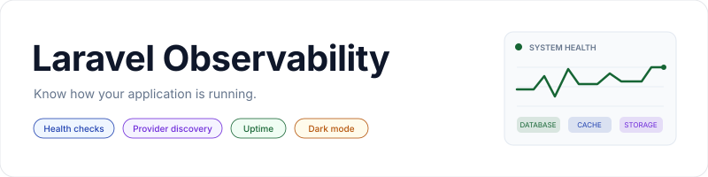

<p align="center">
    <picture>
        <source media="(prefers-color-scheme: dark)" srcset="art/banner-dark.svg">
        <source media="(prefers-color-scheme: light)" srcset="art/banner-light.svg">
        
    </picture>
</p>

<p align="center">
Health checks, monitoring provider discovery, and uptime status for Laravel applications.
</p>

<p align="center">
    <a href="https://packagist.org/packages/jeremykenedy/laravel-observability"></a>
    <a href="https://packagist.org/packages/jeremykenedy/laravel-observability"></a>
    <a href="https://github.com/jeremykenedy/laravel-observability/actions/workflows/tests.yml"></a>
    <a href="https://github.styleci.io/repos/1194847006?branch=main"></a>
    <a href="https://opensource.org/licenses/MIT"></a>
</p>

## Table of Contents

- [Framework Support](#framework-support)
- [Requirements](#requirements)
- [Installation](#installation)
- [Quick Start](#quick-start)
- [Blade](#blade)
- [Livewire](#livewire)
- [Vue](#vue)
- [React](#react)
- [Svelte](#svelte)
- [Features](#features)
- [Configuration](#configuration)
- [Routes and Access](#routes-and-access)
- [Appearance and Published Views](#appearance-and-published-views)
- [Monitoring Providers](#monitoring-providers)
- [Changing Frameworks](#changing-frameworks)
- [Update](#update)
- [Switch](#switch)
- [Artisan Commands](#artisan-commands)
- [Install Options](#install-options)
- [Testing](#testing)
- [License](#license)

## Framework Support

| CSS framework | Blade | Livewire 3 / 4 | Vue 3 | React 18 / 19 | Svelte 4 / 5 |
| --- | --- | --- | --- | --- | --- |
| Tailwind CSS | Yes | Yes | Yes | Yes | Yes |
| Bootstrap 5 | Yes | Yes | Yes | Yes | Yes |
| Bootstrap 4 | Yes | Yes | Yes | Yes | Yes |

Tailwind and Blade remain the defaults. Existing UI Kit settings and published view overrides continue to work. Updating with Composer does not publish files, install frontend dependencies, or change the selected framework.

## Requirements

- PHP 8.2 or newer.
- Laravel 10, 11, 12, or 13. Laravel 13 requires PHP 8.3 or newer.
- An authenticated application layout named `layouts.app`, or a custom `observability.layout` value.
- Livewire, Vue, React, and Svelte are optional. Install the runtime used by your application.

Laravel 10 and 11 remain in the compatibility matrix for existing applications. They are legacy releases with published security advisories. CI allows those dependencies only in isolated compatibility jobs; new installations should use a maintained Laravel release.

## Installation

```bash
composer require jeremykenedy/laravel-observability
php artisan observability:install
```

The installer selects CSS and frontend frameworks, publishes missing configuration, and offers optional monitoring providers. It requires a writable environment file. Credentials are entered with hidden input and stored with quoted values when needed.

Existing installations are detected. Use `observability:update` for routine updates. `--force` skips the reinstall confirmation but still preserves existing configuration, Blade overrides, and published JavaScript files.

For an unattended installation:

```bash
php artisan observability:install --css=tailwind --frontend=blade --no-interaction
```

Laravel UI Kit is optional. To copy its installed framework settings without changing other packages:

```bash
composer require jeremykenedy/laravel-ui-kit
php artisan observability:install --ui-kit
```

Explicit `--css` or `--frontend` flags override the corresponding UI Kit choice. Without `--ui-kit`, the command uses Observability's current selection, falling back to existing UI Kit settings and then Tailwind with Blade. No optional package is installed by Composer updates.

## Quick Start

### Blade

Sign in and visit `/health/dashboard`. The dashboard uses your application's `layouts.app` layout and its `content` section. Package styles and scripts are served locally, with no CDN or Alpine.js requirement.

You can also use the dashboard component in a page:

```blade
<x-observability::dashboard css="tailwind" />
```

### Livewire

Install Livewire in the host application and include its styles and scripts in the layout:

```bash
composer require livewire/livewire
php artisan observability:switch --frontend=livewire
```

```blade
<livewire:health-dashboard />
```

The component follows the selected CSS framework and refreshes through Livewire. The existing `/health/dashboard` route continues to render the Blade page; mount the Livewire component wherever it belongs in your application.

### Vue

```bash
php artisan observability:switch --css=tailwind --frontend=vue
```

```vue
<script setup>
import HealthDashboard from './Pages/Observability/HealthDashboard.vue'
</script>

<template>
    <HealthDashboard css-framework="tailwind" health-url="/health" providers-url="/health/providers" />
</template>
```

### React

```bash
php artisan observability:switch --css=bootstrap5 --frontend=react
```

```jsx
import HealthDashboard from './Pages/Observability/HealthDashboard.jsx'

export default function StatusPage() {
    return <HealthDashboard cssFramework="bootstrap5" healthUrl="/health" providersUrl="/health/providers" />
}
```

### Svelte

```bash
php artisan observability:switch --css=bootstrap4 --frontend=svelte
```

```svelte
<script>
    import HealthDashboard from './Pages/Observability/HealthDashboard.svelte'
</script>

<HealthDashboard cssFramework="bootstrap4" healthUrl="/health" providersUrl="/health/providers" />
```

Vue, React, and Svelte pages are published under `resources/js/Pages/Observability`. Their shared script and scoped styles are published under `resources/js/shared`. Keep those relative paths together. Mount the page using your application's existing router or entry point, then run `npm run build`. The commands do not replace the application's router or install a new build system.

SPA components retain their Bootstrap 5 default. Pass `cssFramework` explicitly to use Tailwind or Bootstrap 4. Pass named route URLs from your server when using a subdirectory or custom health endpoint.

## Features

- Database, cache, storage, and queue-driver health checks.
- Existing JSON endpoints and route names.
- Monitoring provider discovery and enabled-provider lists.
- Optional UptimeRobot and StatusCake API requests.
- Responsive dashboards with system, light, and dark appearance choices.
- Accessible status messages, labeled controls, and visible keyboard focus.
- Safe framework switching that preserves application files.
- Local assets and optional frontend runtimes.

## Configuration

```bash
php artisan vendor:publish --tag=observability-config
```

| Option | Default | Purpose |
| --- | --- | --- |
| `enabled` | `true` | Enable health and dashboard routes |
| `css_framework` | `null` | `OBSERVABILITY_CSS`; falls back to existing UI Kit selection, then `tailwind` |
| `frontend` | `null` | `OBSERVABILITY_FRONTEND`; falls back to existing UI Kit selection, then `blade` |
| `layout` | `layouts.app` | Layout extended by the Blade dashboard |
| `theme` | `system` | Initial appearance: `system`, `light`, or `dark` |
| `health.enabled` | `true` | Register health and dashboard routes |
| `health.route` | `/health` | JSON health endpoint path |
| `health.checks` | `database`, `cache`, `storage`, `queue` | Checks to run |
| `health.middleware` | `[]` | Extra middleware for health routes |
| `providers` | Disabled entries | Provider flags, credentials, packages, and SDK documentation |
| `uptime` | Disabled entries | UptimeRobot and StatusCake credentials |
| `context` | Existing defaults | Reserved configuration retained for compatibility; no automatic context enrichment |

New installations save `OBSERVABILITY_CSS` and `OBSERVABILITY_FRONTEND` in the environment file. Existing `UI_KIT_CSS` and `UI_KIT_FRONTEND` values continue to work through an installed UI Kit configuration. Commands never modify UI Kit's global settings. A hardcoded value in your published config takes precedence over environment changes, so keep framework entries environment-backed when using the commands.

### Routes and Access

| Method | Default path | Route name | Access |
| --- | --- | --- | --- |
| GET | `/health` | `health` | Public unless configured otherwise |
| GET | `/health/providers` | `health.providers` | Public unless configured otherwise |
| GET | `/health/uptime` | `health.uptime` | `web`, `auth`, and configured middleware |
| GET | `/health/dashboard` | `health.dashboard` | `web`, `auth`, and configured middleware |
| GET | `/health/assets/{asset}` | `health.assets` | Public static dashboard assets only; also available when health routes are disabled |

Set `health.middleware` to your application's access middleware when provider names or health status should be private. Dashboard and uptime routes keep their existing authentication requirement. Changing `health.route` changes only the main JSON endpoint; sibling paths remain unchanged for compatibility.

Healthy responses use HTTP 200. Failed or unknown checks use HTTP 503 with the same `status`, `checks`, and `timestamp` fields. Exception details are omitted from public responses. The storage probe checks local-disk write, read, and cleanup. Queue status reports the configured driver; it does not prove that workers are running.

### Appearance and Published Views

The Appearance selector remembers a dashboard-specific choice in browser storage. System mode follows the system preference and existing `.dark` or `data-bs-theme="dark"` ancestors. It does not change the host application's theme. Scoped styles supply dark mode even with Bootstrap 4.

```bash
php artisan vendor:publish --tag=observability-views
```

Existing `resources/views/vendor/observability/dashboard.blade.php` overrides remain first in the lookup order. Framework-specific overrides live under `resources/views/vendor/observability/{css}/blade`. Publishing is optional. Review [the upgrade notes](docs/upgrading.md) before replacing a customized file.

### Monitoring Providers

See the [provider reference](docs/providers.md) for the supported services, SDK documentation, credential setup, browser scripts, and uptime behavior. Each service's SDK or agent is responsible for capturing its own telemetry.

## Changing Frameworks

### Update

```bash
php artisan observability:update
php artisan observability:update --css=bootstrap5 --frontend=vue
```

The interactive menu provides framework selection, credential updates, provider toggles, and status. Publishing configuration only fills missing files. It never replaces your existing config.

| Option | Values | Purpose |
| --- | --- | --- |
| `--css` | `tailwind`, `bootstrap5`, `bootstrap4` | Select CSS framework |
| `--frontend` | `blade`, `livewire`, `vue`, `react`, `svelte` | Select frontend and publish missing SPA files |
| `--ui-kit` | Flag | Copy settings from an installed UI Kit |
| `--no-interaction` | Flag | Keep unspecified choices and skip provider prompts |

### Switch

```bash
php artisan observability:switch --css=bootstrap5
php artisan observability:switch --frontend=livewire
```

| Option | Values | Purpose |
| --- | --- | --- |
| `--css` | `tailwind`, `bootstrap5`, `bootstrap4` | Change CSS while retaining the frontend |
| `--frontend` | `blade`, `livewire`, `vue`, `react`, `svelte` | Change frontend while retaining CSS |

At least one flag is required. Existing configuration and customized files are preserved. After switching a bundled frontend, run `npm run build` and update the component's `cssFramework` prop if needed. The bundled Blade page does not need a frontend build.

## Artisan Commands

| Command | Description | Flags |
| --- | --- | --- |
| `observability:install` | Configure the package, detect existing installation, and offer providers | `--css`, `--frontend`, `--force`, `--ui-kit`, `--no-interaction` |
| `observability:update` | Update choices and manage providers without overwriting config | `--css`, `--frontend`, `--ui-kit`, `--no-interaction` |
| `observability:switch` | Change one or both framework choices | `--css`, `--frontend`, `--no-interaction` |

### Install Options

| Flag | Description |
| --- | --- |
| `--css=` | CSS framework: `tailwind`, `bootstrap5`, `bootstrap4` |
| `--frontend=` | Frontend: `blade`, `livewire`, `vue`, `react`, `svelte` |
| `--force` | Skip the existing-installation confirmation; preserve published files |
| `--ui-kit` | Use framework settings from an installed Laravel UI Kit |
| `--no-interaction` | Use supplied flags or current defaults and skip provider setup |

## Testing

```bash
composer install
composer check
npm ci
npm run build
npm test
npx playwright install chromium
npm run test:browser
```

PHP tests cover framework selection, real environment-file writes, published-file preservation, health failures, authentication, provider output, uptime requests, and Livewire rendering. Browser tests exercise all frontend/CSS combinations, light and dark appearance, refresh recovery, keyboard-accessible controls, and mobile overflow. Svelte 4 is compiled separately to guard existing applications; its compiler is a development-only compatibility fixture with known upstream advisories.

CI runs PHP 8.2 through 8.5 on compatible Laravel 10 through 13 combinations, with Livewire 3 and 4. It also runs Pint, Composer validation and audit, frontend builds, and browser tests. See [upgrade notes](docs/upgrading.md) for the compatibility boundaries.

## License

This package is open-sourced software licensed under the [MIT license](LICENSE).
